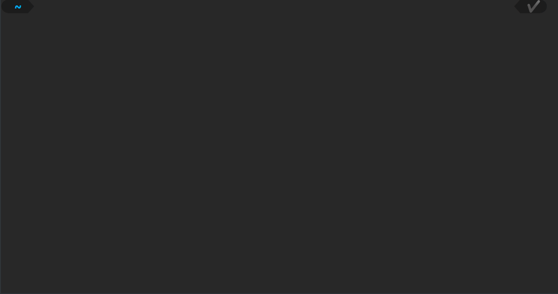

<p align="center">
    :camera_flash: <b>Check out this repo in action!</b> :camera_flash:
    
</p>

# Insta Newspaper [](https://github.com/psf/black)

Insta Newspaper is a CLI to download old newspaper front pages and post it on Instagram.
It was done as a personal project but can be easily be adapted for your needs.

## Installation

The CLI part of the project is based on [typer](https://github.com/tiangolo/typer "typer"), cross-OS compatibility should not be an issue.
Regarding the Instagram posting process, it relies on Selenium with Gecko driver. See the [official repo](https://github.com/mozilla/geckodriver "geckodriver repository") for installation, on most linux distros you could probably use the package `firefox-geckodriver`.

#### Install from source:

```
git clone https://github.com/pablolec/insta_newspaper
cd insta_newspaper
pip install .
```

**To finish installation** mind modifying `config.yaml.example` with your own parameters and renaming it `config.yaml`.

## Demo

<p align="center">
    
</p>

## Usage

- `insta_newspaper new_post -n SELECTED_NAMES [-h]`
  Main command to scrap image(s) and post it on IG. Just replace [SELECTED_NAMES] by one or more newspaper names. Names must be separated by spaces, you can also only input part of the names, the utility will look inside reference for matches.
  Add `-h` to start a headless Gecko driver. No Firefox window will be displayed.

- `insta_newspaper save_cookies`
  A Firefox window will be displayed and you will be prompted to log in manually to Instagram. Then, you can press any key in terminal to close Firefox and store your cookies.

- `insta_newspaper login`
  Simply opens a Firefox window and automatically logs you in. This may be useful to manage your account for example.
